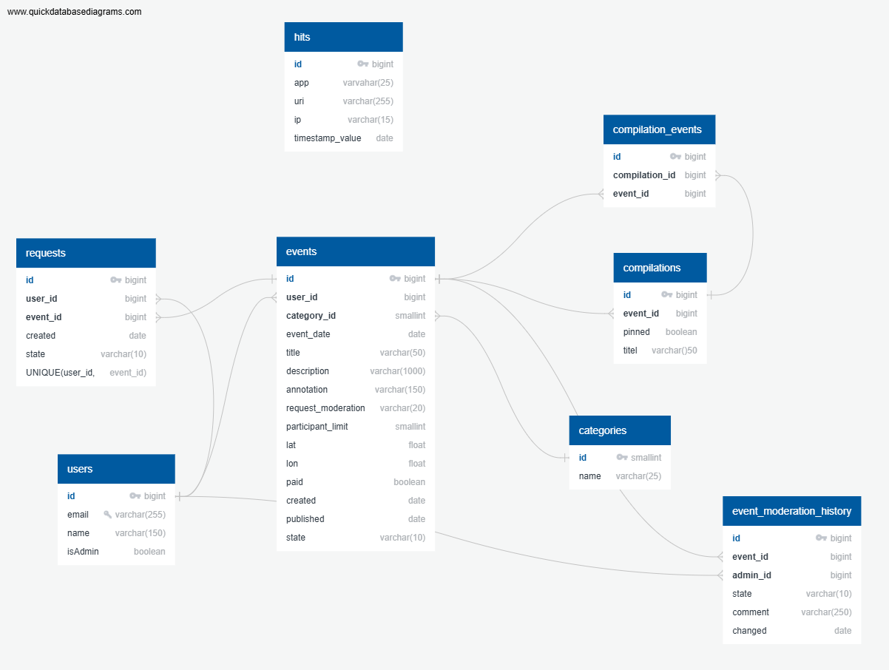

# java-explore-with-me

Repository for "Explore with me" project.

Backend for posting events and submitting applications for participation. API of the main service is divided into open, private and admin access. A registered user can add an event with topic, name, cost of participation, number of possible participants and other information. The administrator checks the event and publishes or decline it, leaves lists of events for the public API. Registered users can apply for participation in the event. The history of moderation of events is saved. The auxiliary service collects statistics on event views.

## Database description
This store is designed as two PostgreSQL databases to store information about user, event, requests of participation, statistic of views. There are eight tables, three of them with indexes.



## Database location
Both of databases are in the docker containers, that will be created using docker compose file.

## Run application
The application starts using the [explore-service-0.0.1-SNAPSHOT.jar](explore-service/target/explore-service-0.0.1-SNAPSHOT.jar) file.

## Technology stack
Java, Spring Boot, Maven plugin, Docker compose, Hibernate, JPA, HttpClient, Postman tests
Also Lombok, Mapstruct

## Algorithms

To update event with changing of status, showing participants requests, statistic of views, saving action in moderation history.

```java
@Override
@Transactional
public EventFullDto updateEvent(UpdateEventAdminRequest updateRequest, long eventId) {
    Event event = validateEventNotFound(eventId);
    log.info("Event admin service, updating event: event={}", event);

    Category category = null;
    if (updateRequest.hasCategory()) {
        category = validateCategoryNotFound(updateRequest.getCategory());
    }
    eventMapper.updateEventFields(event, updateRequest, category);

    updateState(updateRequest, event);
    event = eventRepository.save(event);
    log.info("Event admin service, updating event: updatedEvent={}", event);

    Map<Long, Long> statistic = statisticService.getStatsByEvents(List.of(event), false);
    Map<Long, Integer> confirmedRequests = new HashMap<>();
    if (event.isRequestModeration()) {
        confirmedRequests = requestService.getCountOfConfirmedRequestsByEvents(List.of(event));
    }
    log.info("Event admin service, updating event: statistic={}, confirmedRequests={}", statistic, confirmedRequests);

    String moderationComment = null;
    if (event.getState().equals(Event.State.FIX_NEED) || event.getState().equals(Event.State.REJECTED)) {
        moderationComment = updateRequest.getComment();
    }
    moderationService.addModeration(event, null, event.getState(), moderationComment);

    return eventMapper.mapEventToEventFullDto(event,
            confirmedRequests.getOrDefault(event.getId(), 0),
            statistic.getOrDefault(event.getId(), 0L),
            moderationComment);
}
```
Specification is used for getting a list of events with selection by many params, sorting and limit setting.

```java
private Specification<Event> getEventSpecification(EventFilterRequest filterRequest) {
    Specification<Event> specification = Specification.where(null);
    if (Objects.nonNull(filterRequest.getText()) && !filterRequest.getText().isBlank()) {
        String search = "%" + filterRequest.getText().toLowerCase() + "%";
        specification = specification.and((root, query, cb) ->
                cb.or(
                        cb.like(cb.lower(root.get("annotation")), search),
                        cb.like(cb.lower(root.get("description")), search)
                ));
    }
    if (Objects.nonNull(filterRequest.getPaid())) {
        specification = specification.and((root, query, cb) -> cb.equal(root.get("paid"), filterRequest.getPaid()));
    }
    if (Objects.nonNull(filterRequest.getCategories()) && !filterRequest.getCategories().isEmpty()) {
        specification = specification.and((root, query, cb) -> root.get("category").get("id").in(
                filterRequest.getCategories().stream().filter(Objects::nonNull).toList()));
    }
    LocalDateTime rangeStart = filterRequest.getRangeStart();
    LocalDateTime rangeEnd = filterRequest.getRangeEnd();
    if (Objects.nonNull(rangeStart) && Objects.nonNull(rangeEnd) && !rangeEnd.isAfter(rangeStart)) {
        throw new ValidationException(String.format("""
                Fields: rangeStart, rangeEnd. Start date should be before end date.
                Current value start: %s, end: %s""", rangeStart, rangeEnd));
    }
    if (Objects.nonNull(rangeStart)) {
        specification = specification.and((root, query, cb) -> cb.greaterThanOrEqualTo(root.get("eventDate"), rangeStart));
    }
    if (Objects.nonNull(rangeEnd)) {
        specification = specification.and((root, query, cb) -> cb.lessThanOrEqualTo(root.get("eventDate"), rangeEnd));
    }
    if (Objects.nonNull(filterRequest.getPaid())) {
        specification = specification.and((root, query, cb) -> cb.equal(root.get("paid"), filterRequest.getPaid()));
    }
    if (Objects.nonNull(filterRequest.getOnlyAvailable()) && filterRequest.getOnlyAvailable()) {
        specification = specification.and((root, query, cb) -> {
            assert query != null;
            Subquery<Long> subquery = query.subquery(Long.class);
            Root<ParticipantRequest> requestRoot = subquery.from(ParticipantRequest.class);
            subquery.select(cb.count(requestRoot.get("id")))
                    .where(cb.equal(requestRoot.get("event"), root));

            return cb.greaterThan(root.get("participantLimit"), subquery);
        });
    }
    specification = specification.and((root, query, cb) -> cb.equal(root.get("state"), Event.State.PUBLISHED.name()));
    return specification;
}
```
